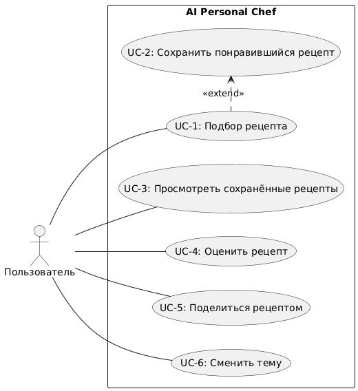

# Use-case Narrative

Детальное описание пользовательских сценариев с альтернативными путями

## UC1: Подбор рецепта

Happy Path:

1. Пользователь нажимает «Подобрать рецепт».
1. Выбирает: сделать фото.
1. Делает фото продуктов при хорошем освещении.
1. Система распознаёт ингредиенты.
1. Система анализирует продукты и отображает результаты.

Alternative Flows:

- AF1: Пользователь выбирает вводит продукты вручную.
- AF2: Пользователь делает несколько фото.
- AF3: Пользователь редактирует распознанный список.

Error Handling:

- EH1: Фото слишком тёмное/размытое → система выдает предупреждение о низком качестве фото.
- EH2: Не удалось распознать ни одного продукта → система предлагает ввести продукты вручную.

User Value:

- Позволяет быстро сообщить системе, что есть в наличии.

## UC2: Сохранить понравившийся рецепт

Happy Path:

1. Пользователь просматривает список предложенных рецептов.
1. Нажимает кнопку «Сохранить» у интересного рецепта.
1. Рецепт добавляется в раздел «Избранное».

Alternative Flows:

- AF1: Сохраняет рецепт в определенную категорию.

Error Handling:

- EH1: Ошибка синхронизации → рецепт сохраняется локально.
- EH2: Рецепт уже в избранном → сердечко становится красным, показывается уведомление.

User Value:

- Позволяет легко собирать рецепты в одну библиотеку, чтобы быстро находить в будущем.

## UC3: Просмотреть сохранённые рецепты

Happy Path:

1. Пользователь переходит в раздел «Избранное».
1. Видит список всех сохранённых рецептов.
1. Открывает рецепт — видит ингредиенты, шаги, калории.

Alternative Flows:

- AF1: Использует поиск по названию: «паста», «суп».
- AF2: Просматривает определенную категорию.

Error Handling:

- EH1: Нет сохранённых рецептов → показывается пустой экран с подсказкой: «Начни с фото продуктов».

User Value:

- Быстрый доступ к проверенным рецептам без повторного поиска. Упрощает планирование питания.

## UC4: Оценить рецепт

Happy Path:

1. Пользователь после готовки открывает рецепт.
1. Вводит кол-во звезд.
1. Оценка отправляется в систему.

Alternative Flows:

- AF1: Пользователь меняет оценку позже → система обновляет историю.

Error Handling:

- EH1: Оценка не отправилась (ошибка сети) → сохраняется локально, отправится при восстановлении связи.
- EH2: Пользователь пытается поставить 6 звёзд → система отображает предупреждение.

User Value:

- Чем чаще пользователь оценивает рецепты — тем точнее будут будущие рекомендации.

## UC5: Поделиться рецептом

Happy Path:

1. Пользователь открывает рецепт.
1. Нажимает «Поделиться».
1. Выбирает способ.
1. Отправляет красивую карточку.

Alternative Flows:

- AF1: Пользователь делится в виде картинки → удобно для историй.
- AF2: Пользователь делится в виде файла → удобно для личных сообщений.

Error Handling:

- EH2: Ошибка генерации превью → показывается стандартная карточка без фото.

User Value:

- Позволяет делиться проверенными и удачными рецептами.

## UC6: Сменить тему

Happy Path:

1. Пользователь заходит в «Настройки».
1. Нажимает «Тема».
1. Выбирает «Тёмная».
1. Интерфейс приложения переключается.

Alternative Flows:

- AF1: Пользователь выбирает «Авто» → тема меняется по времени суток.
- AF2: Пользователь включает тёмную тему только для ночного режима готовки → активируется при открытии приложения после 22:00.

Error Handling:

- EH1: Тема не применилась → приложение перезагружает UI.

User Value:

- Комфортное использование при любом освещении.

## Use-case UML диаграмма

